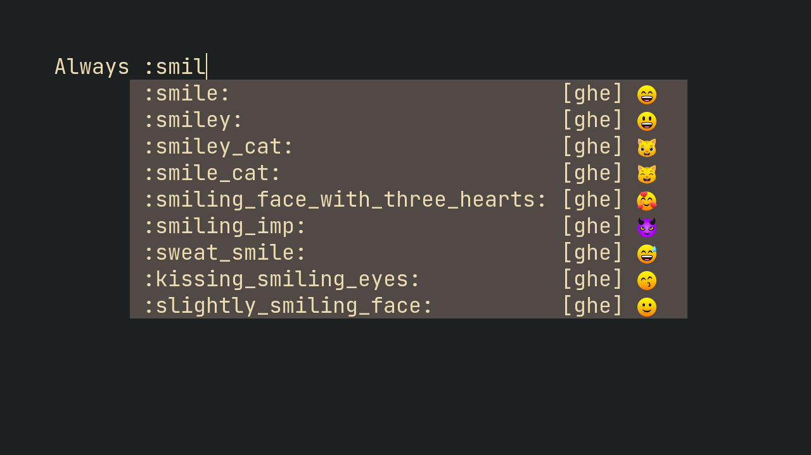

# ncm2-github-emoji [](https://github.com/subnut/ncm2-github-emoji "Github repo link")
<p align="center">


<a href="https://neovim.io"></a>
<br/>
<a href="https://github.com/subnut/ncm2-github-emoji"></a>
<a href="https://github.com/subnut/ncm2-github-emoji/issues"></a>

<br/>
<a href="https://github.com/subnut"></a>
<a href="https://github.com/psf/black"></a>
<a href="https://github.com/subnut/ncm2-github-emoji/blob/master/LICENSE"></a>
</p>
<br/>

GitHub emoji source for [NCM2](https://github.com/ncm2/ncm2)

<p align="center">

</p>

## Installation

### Basic installation

Install it like you would install any other plugin. Then, at the plugin's installation directory (i.e. which contains `install.py`) run the following command -
```
python install.py
```
This pulls the latest emojis from GitHub's API and **creates the actual plugin** file.


### Installation using plugin managers
Some plugin managers support running a command after a plugin has been installed. Check with the plugin developer if yours supports it. If yes, you can simply do something like this (example is of [vim-plug](https://github.com/junegunn/vim-plug))
```
Plug 'subnut/ncm2-github-emoji', { 'do': 'python install.py' }
```

<br/>

## Known Issues
* Preview does not work for GitHub-special emojis
